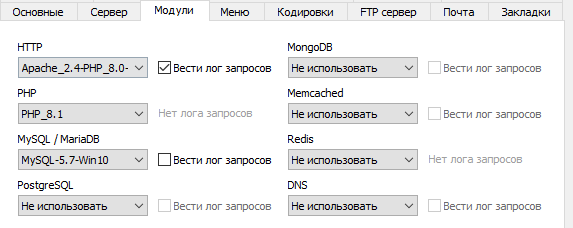
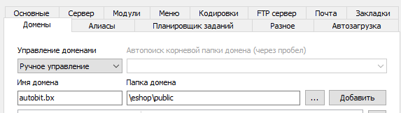

# О проекте
Интернет магазин автомобилей AutoBit. Разработан командой КДКБ в рамках 2 модуля курса Веб-разработчик Битрикс24//Университет 2023
***
# Системные требования
## Веб-сервер: 
Open Server версии не ниже **5.4.3**
## Папка с проектом:
Находится в директории OSPanel/domains/

## Необходимые настройки сервера: 
**HTTP:** Apache_2.4-PHP_8.0-8.1 <br>
**PHP:** PHP_8.1 <br>
**MySql/MariaDB:** MySql-5.7-Win10

 
### Папка домена:
#### eshop\public <br>

### **Никаких дополнительных расширений не требуется**

***
# Запуск проекта

1) Создать базу данных с произвольным названием

2) В папке /core/config создать файл config.local.php со следующими полями
```php
<?php
return [
   	'DB_HOST' => '<Ваш IP адрес>',
   	'DB_NAME' => '<Название базы данных>',
   	'DB_USER' => '<Логин для доступа в БД>',
   	'DB_PASSWORD' => ' <Пароль для доступа в БД>',
   	'DB_TABLE_MIGRATION' => 'migration',
	]; 
```

3) При первом запуске сайта запустится миграция и добавятся тестовые данные

4) Для доступа в административную панель используйте login: *admin* password: *111*
***
# Для разработчиков:
## Точка входа:
У приложения точка входа является единственным файлом public/index.php <br>
Все настройки ModRewrite уже заданы и находятся в файле /public/.htaccess
## Подключение автотестов:
Установить PhpUnit и подключить GuzzleHtml.